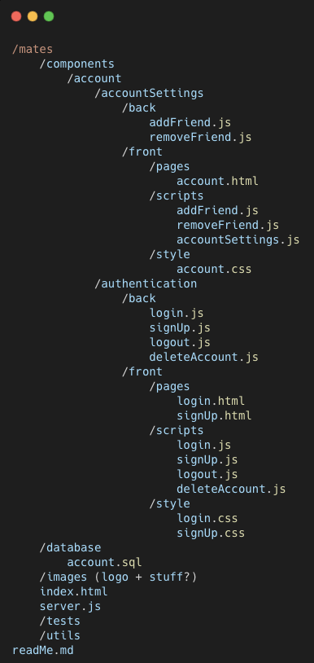

## Stage 1 - Account Management

In this stage of development, the focus is on basic features of account management:
    - Sign Up
    - Log in
    - Logout
    - Delete Account
    - Add Friend
    - Remove Friend

## Table of Contents

- [Features Implemented](#features-implemented)
- [Files and Directories Added/Modified](#files-and-directories-addedmodified)
- [Part 1](#part-1---Basic-Structure)
- [Part 2](#part-2---sign-up)
- [Part 3](#part-3---login)
- [Logout](#logout)
- [Delete Account](#delete-account)
- [Add Friend](#add-friend)
- [Remove Friend](#remove-friend)

## Features Implemented

- SignUp
- Login
- Logout
- Delete account
- Add friend
- Remove friend

## Files and Directories Added/Modified

## Part 1 - Basic Structure

## Part 2 - Sign Up

1. Capture User Input:
    - Use JavaScript to select the relevant input fields (e.g., username, password) from the sign-up form.
    - Capture the values entered by the user using properties like .value.

2. Validate Input:
    - Check if the captured values are not empty and meet certain criteria (e.g., password strength).
    - You might use regular expressions or built-in validation methods for this.

3. Send POST Request to Server:
    - Create an event listener for the sign-up form's submit button.
    - When the user submits the form, prevent the default form submission behavior using event.preventDefault().
    - Create a JavaScript object containing the user's sign-up data (username, password).
    - Use the fetch() API or another AJAX method to send a POST request to the server.
    - The request should include the user's data in the request body, typically in JSON format.

4. Server-Side Processing:
    - On the server, create an endpoint (e.g., /signup) to handle the incoming POST request.
    - Retrieve the data from the request's body.
    - Validate the data again on the server side to ensure security.
    - Hash and salt the password before storing it in the database.
    - Execute SQL queries (or use an ORM) to insert the user's data into the database.

5. Response to Client:
    - Send an appropriate response back to the client indicating success or failure.
    - You might send a JSON response containing a message or a status code.

## Part 2 - Login

1. Capture User Input:
    - Similar to sign-up, select the login form's input fields and capture the entered values.    

2. Send POST Request to Server:
    - Create an event listener for the login form's submit button.
    - Prevent the default form submission behavior.
    - Build a JavaScript object with the user's login data (username, password).
    - Use fetch() or an AJAX method to send a POST request to the server's login endpoint.

3. Server-Side Processing:
    - On the server, create a login endpoint (e.g., /login) to handle the POST request.
    - Retrieve the login data from the request's body.
    - Check the database to find a matching username.
    - If found, compare the provided password with the hashed password in the database.

4. Session/Cookie Management:
    - If the credentials are correct, create a session or cookie for the user to maintain their login status.
    - Sessions typically involve creating a unique identifier and storing user data on the server or in a database.

5. Response to Client:
    - Send a response back to the client indicating successful login or authentication failure.

## Logout

<!-- Add detailed information about the Logout feature -->

## Delete Account

<!-- Add detailed information about the Delete Account feature -->

## Add Friend

<!-- Add detailed information about the Add Friend feature -->

## Remove Friend

<!-- Add detailed information about the Remove Friend feature -->

## Contributors

None

## License

Stage 1: User Account Management

1. Set Up the Basic Structure

Create the necessary directories: mates, components, account, accountSettings, authentication, back, front, pages, scripts, and style.
Create the account.html page within the pages directory.
Create the accountSettings.js, addFriend.js, removeFriend.js, login.js, signUp.js, logout.js, and deleteAccount.js files in their respective locations.
Include basic HTML structure in account.html and link the necessary CSS and JavaScript files.

2. Implement User Sign-Up

In signUp.js, add event listeners to the sign-up form's submit button.
Use JavaScript to capture user input from the form (e.g., username, password).
Validate the input data (e.g., check for empty fields, strong password).
Send a POST request to the server with the user's sign-up data.
Implement server-side logic in signup.js to handle the sign-up process.
Update the database (e.g., using SQL queries) to store the new user's information.

3. Implement User Login

In login.js, add event listeners to the login form's submit button.
Capture user input (username, password) and validate it.
Send a POST request to the server with the user's login data.
Implement server-side logic in login.js to verify the user's credentials.
If the credentials are correct, set up a session/cookie to maintain the user's login status.

4. Implement User Logout

In logout.js, add event listeners to the logout button.
Send a request to the server to clear the session/cookie.
Update the front-end to reflect the user's logged-out status.

5. Implement Account Deletion

In deleteAccount.js, add event listeners to the delete account button.
Display a confirmation prompt to ensure the user wants to delete the account.
If confirmed, send a request to the server to delete the user's account.
Update the database to remove the user's information.
Clear the session/cookie to log the user out.

6. Implement Adding and Removing Friends

In addFriend.js, add event listeners to the "Add Friend" button.
Capture the friend's username from the input field.
Validate the input and check if the friend's username exists.
Send a request to the server to add the friend to the user's list.
In removeFriend.js, add event listeners to the "Remove Friend" button.
Send a request to the server to remove the friend from the user's list.

7. Testing and Debugging

Test each functionality individually to ensure they work as expected.
Check for any errors in the console and debug as necessary.
Simulate different scenarios (e.g., invalid login, adding/removing friends) to ensure robustness.

